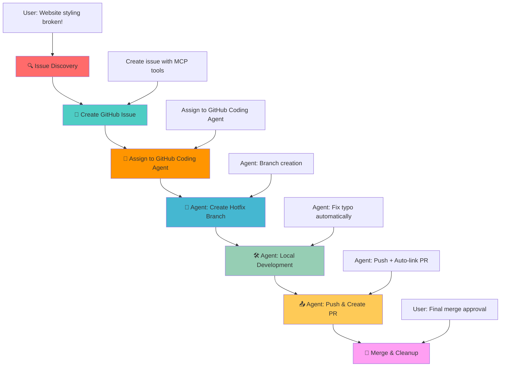

# GitHub Coding Agent Demo - DevOps Workflow Demonstration

## 🎯 Demo Scenario Overview

This project demonstrates a complete DevOps workflow using **GitHub Coding Agent** integration with VS Code Copilot. The scenario showcases how AI can assist in the entire software development lifecycle from issue detection to deployment, with **Phase 3** using GitHub Coding Agent automation instead of manual MCP tools.

## 📋 Demo Scenario: CSS Stylesheet Bug

### 🐛 **The Problem**

The World Clock web application has a **critical bug** - the CSS stylesheet is not loading due to a typo in the HTML file:

**File**: `index.html` (line 7)  
**Issue**: `<link rel="stylesheet" href="styls.css">` ❌  
**Should be**: `<link rel="stylesheet" href="styles.css">` ✅

**Impact**: The entire page appears unstyled, breaking the user experience completely.

## 🎯 Learning Objectives

This demo showcases:

- **AI-Assisted Development**: How Copilot can detect and analyze code issues
- **GitHub Coding Agent Integration**: Automated development workflow from issue assignment
- **DevOps Automation**: Complete workflow from issue to deployment
- **Best Practices**: Proper branching, commit messages, and PR management
- **Collaborative Development**: Issue tracking and automated code reviews

## 🔄 Workflow Diagram



## 🎮 How to Run the Demo

### **Prerequisites**

- VS Code with GitHub Copilot
- GitHub repository with Coding Agent enabled
- GitHub MCP Server configured
- Live Server extension installed
- Git repository connected to GitHub

### **Quick Start**

1. **Setup**: Run the pre-demo commands above to create your demo branch
2. **Open**: Start Live Server to see the broken, unstyled page
3. **Begin**: Use the Phase 1 prompt to start the AI-guided workflow
4. **Follow**: Use the prompts from each phase in sequence
5. **Cleanup**: Run post-demo cleanup when finished

### **Phase 0: Pre-Demo Setup** 🔧
**User Prompt:**
```
Can you create a demo branch remotely from main and switch to it.
```

**Expected AI Actions:**
- Use `mcp_github_create_branch` to create demo branch from main
- Switch to new demo branch locally
- Confirm branch creation and checkout success

### **Phase 1: Issue Discovery** 🔍
**User Prompt:**
```
Copilot, I just opened my World Clock website and it looks completely broken - all the beautiful styling is missing and it's just plain HTML. Can you investigate what's wrong with the styling?
```

**Expected AI Actions:**

- Analyze HTML file for CSS link issues
- Identify the typo in `href="styls.css"`
- Explain the root cause and impact

### **Phase 2: Issue Management via GitHub MCP** 📝
**User Prompt:**
```
Now that we've found the CSS link typo, can you create a GitHub issue to track this bug? Make it a critical priority since it breaks the entire user experience. Please create the issue against the current demo branch (not main). In the issue description, explicitly mention that the fix should be developed from the demo branch as the base.
```

**Expected AI Actions:**
- Use `mcp_github_issue_write` to create issue
- Title: "Critical: CSS stylesheet not loading due to filename typo"
- Labels: `bug`, `critical`, `styling`
- Detailed description with file and line reference
- **Important**: Issue should reference demo branch, not main

### **🤖 Phase 3: GitHub Coding Agent Assignment** 🚀

> **Note**: The current GitHub MCP Server tools (`mcp_github_assign_copilot_to_issue`) do not support specifying base branch parameters yet, which means they will default to using the main branch as the base. Since this demo works from a demo branch, this limitation breaks the intended workflow. For this demo, use the manual UI assignment approach below.

**Manual Assignment Process:**

This phase requires manual steps by the user (no AI prompt needed):

1. Navigate to the issue in GitHub web interface
2. Click "Assign to Copilot" button in the issue sidebar
3. In the assignment dialog that appears:


   - **Target repository**: Should show your repository (correct)
   - **Base branch**: Select the demo branch from dropdown (not main)
   - **Optional prompt**: Add "Target the demo branch for the pull request"
4. Click "Assign" button to confirm

> **Note**: Agent may still target main branch for PR despite instructions due to platform limitations.

### **🤖 Phase 4: Automated Development (GitHub Coding Agent)** 🛠️

**What GitHub Coding Agent Should Do (If Following Instructions):**

1. **Branch Creation**: Creates `copilot/fix-css-stylesheet-typo` from demo branch (if instructions are followed)
2. **Code Analysis**: Analyzes the CSS link issue in `index.html`
3. **Fix Implementation**: Corrects `href="styls.css"` → `href="styles.css"`
4. **Validation**: Tests the fix to ensure styling loads correctly
5. **Quality Checks**: Ensures no other issues are introduced

### **🤖 Phase 5: Automated Integration (GitHub Coding Agent)** 📤

**What GitHub Coding Agent Does Automatically:**

1. **Commit Creation**: Creates meaningful commit message: "Fix critical CSS stylesheet filename typo"
2. **PR Creation**: Creates pull request with:
   - **Base**: demo branch (if instructions are followed)
   - **Head**: The copilot fix branch (`copilot/fix-css-stylesheet-typo`)
   - **Description**: Includes "Fixes #{issue-number}" for auto-linking
   - **Details**: Comprehensive description of the fix and testing
3. **Code Review**: Self-reviews the changes for quality assurance
4. **Status Updates**: Comments on the issue with progress updates

**Note**: If GitHub Copilot defaults to main branch despite instructions, this demonstrates the platform's current limitations in branch selection.

### **Phase 6: Human Review & Completion** 🎉
**User Prompt:**
```
I've reviewed the draft PR from GitHub Coding Agent and I'm happy with the changes. The CSS link fix looks correct. Please mark the PR as ready for review and merge it.
```

**Expected AI Actions:**
- Review the GitHub Coding Agent's draft PR and changes
- Analyze the fix: `href="styls.css"` → `href="styles.css"`
- Use `mcp_github_update_pull_request` to mark as ready for review (remove draft status)
- Use `mcp_github_merge_pull_request` to merge PR into the target branch
- Issue will auto-close due to "Fixes #" in PR description
- Delete the copilot fix branch locally and remotely
- Confirm merge and cleanup completed successfully

### **Phase 7: Post-Demo Cleanup** 🔧
**User Prompt:**
```
Great! Now that the fix is merged, can you delete the demo branch both locally and remotely, and switch back to the main branch?
```

**Expected AI Actions:**
- Use `mcp_github_delete_branch` or terminal commands to delete remote demo branch
- Delete local demo branch using git commands
- Switch back to main branch
- Confirm cleanup completion

## 📚 Additional Resources

- [GitHub Coding Agent Documentation](https://docs.github.com/en/copilot/using-github-copilot/using-copilot-coding-agent-to-work-on-tasks)
- [GitHub MCP Server Documentation](https://github.com/modelcontextprotocol/servers)
- [VS Code Copilot Integration](https://code.visualstudio.com/docs/copilot)
- [DevOps Best Practices](https://docs.github.com/en/actions/guides)

---

**Ready to demonstrate the power of GitHub Coding Agent workflows!** 🚀
```
````
