# GitHub Coding Agent Demo - DevOps Workflow Demonstration

## 🎯 Demo Scenario Overview

This project is the **second installment** in a comprehensive AI development workflow series, demonstrating the evolution from manual, human-guided workflows to **autonomous AI-driven development**.

**Demo Series Evolution:**
- **[GitHub MCP Demo](https://github.com/david-pizzi-cg/github-mcp-demo)**: Human-guided AI workflow (AI as tool)
- **This Demo**: **Autonomous AI workflow (AI as teammate)**
- **[GitHub Copilot Instructions Demo](https://github.com/david-pizzi-cg/github-copilot-instructions-demo)**: Safeguards AI workflow (AI as quality gatekeeper)

**Philosophy Shift**: 
- **Previous Demo**: Human-in-the-loop approach where AI assists but requires constant guidance
- **This Demo**: AI-autonomous approach where humans delegate complex tasks to AI agents

This demonstrates the transition from **AI as a tool** (requiring step-by-step human direction) to **AI as a teammate** (capable of independent problem-solving and execution).

## 📋 Demo Scenario: CSS Stylesheet Bug

### 🐛 **The Demo Scenario**

The World Clock web application has a **critical bug** - the CSS stylesheet is not loading due to a typo in the HTML file:

**File**: `index.html` (line 7)  
**Issue**: `<link rel="stylesheet" href="styls.css">` ❌ (missing 'e')  
**Should be**: `<link rel="stylesheet" href="styles.css">` ✅

**Impact**: The entire page appears unstyled, breaking the user experience completely.

### 🤖 **The Autonomous AI Strategy**

This demo showcases the evolution to autonomous AI workflows where AI operates independently with minimal human oversight:

1. **Issue Assignment**: Human creates issue and assigns it directly to GitHub Coding Agent
2. **Autonomous Planning**: AI analyzes requirements and creates execution plan
3. **Independent Execution**: AI handles branching, coding, testing, and PR creation without step-by-step prompts
4. **Human Review**: Focus shifts from directing to reviewing and approving completed work

## 🎯 Learning Objectives

This demo showcases:
- **Autonomous AI Development**: How AI can work independently with minimal human guidance
- **GitHub Coding Agent Integration**: Automated development workflow from issue assignment to completion
- **Task Delegation**: Moving from step-by-step prompting to high-level task assignment
- **AI Independence**: Complex problem-solving and execution without constant oversight
- **Advanced DevOps**: Autonomous branching, coding, testing, and PR creation
- **Human-AI Collaboration**: Evolved partnership where humans review rather than direct

## 🔄 Workflow Diagram

```mermaid
graph TD
    A[🔍 Issue Discovery] --> B[📝 Create GitHub Issue]
    B --> C[🤖 Assign to GitHub Coding Agent]
    C --> D[🌿 Agent: Create Hotfix Branch]
    D --> E[🛠️ Agent: Local Development]
    E --> F[📤 Agent: Push & Create PR]
    F --> G[🎉 Merge & Review]
    G --> H[✅ Verify & Close Issue]
    H --> I[🔧 Cleanup & Return to Main]

    A1["User: Website styling broken!"] --> A
    B1["Create issue with MCP tools"] --> B
    C1["Assign to GitHub Coding Agent"] --> C
    D1["Agent: Branch creation"] --> D
    E1["Agent: Fix typo automatically"] --> E
    F1["Agent: Push + Auto-link PR"] --> F
    G1["User: Review and merge PR"] --> G
    H1["Pull changes & verify fix"] --> H
    I1["Delete demo branch & cleanup"] --> I

    style A fill:#ff6b6b
    style B fill:#4ecdc4
    style C fill:#ff9500
    style D fill:#45b7d1
    style E fill:#96ceb4
    style F fill:#feca57
    style G fill:#ff9ff3
    style H fill:#a8e6cf
    style I fill:#dcedc1
```



## 🎮 How to Run the Demo

This interactive demo showcases autonomous AI workflows where AI operates independently with minimal human guidance. You'll experience the evolution from directing AI to delegating complete tasks.

**🎯 What You'll Experience:**
Transition from step-by-step AI guidance to high-level task delegation, where AI autonomously handles complex development workflows.

### **Prerequisites**

- **VS Code with GitHub Copilot**: AI development teammate ready for autonomous operation
- **GitHub Coding Agent enabled**: For autonomous development workflows
- **GitHub MCP Server configured**: For seamless GitHub operations
- **Live Server extension installed**: OPTIONAL - to visualize the bug and fix
- **Git repository connected to GitHub**: With Coding Agent permissions

### **🔧 MCP Server Setup**

Before starting the demo, ensure the GitHub MCP Server is running:

1. **Open VS Code** in this project directory
2. Press **Ctrl+Shift+P** to open the Command Palette and search for `MCP: Show Installed Server`
3. The **MCP Servers - Installed** panel will appear in the bottom left of VS Code
4. Find **github** in the list, right-click it, and select **Start Server**
5. **Verify connection** – the server should show as "Connected" or "Running"
6. **Test MCP tools** – you should see GitHub MCP functions available in Copilot

**Troubleshooting:**
- If no Start button or MCP server appears, ensure the `.vscode/mcp.json` file exists
- Restart VS Code if the MCP server doesn't appear
- Check that GitHub Copilot extension is properly authenticated
- **For detailed setup instructions**: [GitHub MCP Server Documentation](https://github.com/github/github-mcp-server)
- **For MCP with Copilot Chat**: [GitHub Copilot MCP Documentation](https://docs.github.com/en/copilot/how-tos/provide-context/use-mcp/extend-copilot-chat-with-mcp)

### **The Journey Ahead: Quick Start Overview**

1. **🔧 Setup & Assignment**: Create demo branch and assign issue to GitHub Coding Agent
2. **🤖 Autonomous Planning**: Watch AI analyze requirements and create execution plan
3. **🛠️ Independent Execution**: AI handles branching, coding, and PR creation autonomously
4. **👨‍💻 Human Review**: Focus on reviewing completed work rather than directing each step
5. **✨ Streamlined Workflow**: Experience the efficiency of AI-as-teammate collaboration

**Ready to delegate complex tasks to your AI teammate?** Follow the phases below for autonomous AI development.

### **Phase 0: Pre-Demo Setup** 🔧

**🎪 Setting the Stage for Autonomous AI Development**

Create a demonstration environment where AI will work independently with minimal oversight.

**What this phase achieves**: Creates a dedicated `demo` branch for safe experimentation with autonomous AI workflows.

**User Prompt:**
```
Can you create a demo branch remotely from main and switch to it.
```

**Expected AI Actions:**
- Use `mcp_github_create_branch` to create demo branch from main
- Switch to new demo branch locally
- Confirm branch creation and checkout success

### **Phase 1: Issue Discovery** 🔍

**🕵️ Autonomous Investigation: AI-Driven Problem Analysis**

Request AI to investigate the styling issue. Unlike the guided approach, AI will autonomously perform comprehensive analysis.

**What this phase achieves**: Demonstrates AI's ability to independently analyze problems and provide detailed technical assessment without step-by-step guidance.

**User Prompt:**
```
Copilot, I just opened my World Clock website and it looks completely broken - all the beautiful styling is missing and it's just plain HTML. Can you investigate what's wrong with the styling?
```

**Expected AI Actions:**
- Analyze HTML file for CSS link issues
- Identify the typo in `href="styls.css"`
- Explain the root cause and impact

### **Phase 2: Issue Management via GitHub MCP** 📝

**📋 Autonomous Issue Creation: AI-Driven Project Management**

Demonstrate how AI autonomously creates comprehensive GitHub issues with proper categorization and detailed descriptions.

**What this phase achieves**: Shows AI's ability to independently manage project tracking by creating well-structured issues with appropriate metadata.

**User Prompt:**
```
Now that we've found the CSS link typo, can you create a GitHub issue to track this bug? Make it a critical priority since it breaks the entire user experience. Please create the issue against the current demo branch (not main).
```

**Expected AI Actions:**
- Use `mcp_github_issue_write` to create comprehensive bug report
- Autonomous title generation: "Critical: CSS stylesheet not loading due to filename typo"
- Intelligent labeling: `bug`, `critical`, `styling`
- Detailed description with file and line reference
- Proper branch context targeting demo branch

### **Phase 3: GitHub Coding Agent Assignment** 🚀

**🤖 Autonomous Task Delegation: From Human Direction to AI Independence**

This is where the magic happens - instead of guiding AI step-by-step, you simply assign the entire task to GitHub Coding Agent and let it work autonomously.

**What this phase achieves**: Demonstrates the shift from micro-management to task delegation, where AI takes full ownership of the development workflow.

**User Prompt:**
```
Perfect! Now I want to assign this issue to GitHub Coding Agent so it can fix this bug autonomously. Can you assign the issue to Copilot and make sure it targets the demo branch for any PR it creates?
```

**Expected AI Actions:**
- Use GitHub MCP tools to assign issue to Coding Agent
- Provide clear instructions for targeting demo branch
- Set up autonomous workflow for AI teammate
- Confirm assignment and next steps

### **Phase 4: Autonomous Development (GitHub Coding Agent)** 🛠️

**🔧 AI Teammate in Action: Independent Problem-Solving**

Watch as GitHub Coding Agent autonomously analyzes the problem, creates a solution strategy, and implements the fix without requiring step-by-step guidance.

**What this phase achieves**: Demonstrates AI working independently - analyzing requirements, planning approach, implementing solution, and preparing for review.

**Expected GitHub Coding Agent Actions:**
1. **Autonomous Analysis**: Independently analyzes the CSS link issue
2. **Strategic Planning**: Creates execution plan for bug fix
3. **Branch Creation**: Creates appropriate feature/fix branch
4. **Code Implementation**: Corrects `href="styls.css"` → `href="styles.css"`
5. **Quality Verification**: Tests the fix to ensure functionality
6. **Documentation**: Prepares comprehensive change description

### **Phase 5: Autonomous Integration (GitHub Coding Agent)** 📤

**🚀 AI-Driven Integration: From Fix to Review-Ready PR**

GitHub Coding Agent autonomously handles the entire integration workflow, creating a polished PR ready for human review.

**What this phase achieves**: Shows AI's ability to handle complex integration tasks including commit creation, PR preparation, and issue linking.

**Expected GitHub Coding Agent Actions:**
1. **Professional Commits**: Creates meaningful commit messages with proper formatting
2. **Comprehensive PR**: Creates detailed pull request with:
   - Clear description of the bug and fix
   - Automated linking to original issue
   - Code change summary
   - Testing verification notes
3. **Quality Documentation**: Includes all necessary context for human review
4. **Process Automation**: Handles all technical aspects of PR creation
   - **Base**: demo branch (if instructions are followed)
   - **Head**: The copilot fix branch (`copilot/fix-css-stylesheet-typo`)
   - **Description**: Includes "Fixes #{issue-number}" for auto-linking
   - **Details**: Comprehensive description of the fix and testing
3. **Code Review**: Self-reviews the changes for quality assurance
4. **Status Updates**: Comments on the issue with progress updates

### **👁️ Monitoring GitHub Coding Agent Progress**

**Phase 5 is a long-running automated phase.** Here's how to track the GitHub Coding Agent's work:

#### **🔍 Step 1: Track Agent Session Progress**
After assigning the issue to GitHub Coding Agent, you can monitor its progress:

1. **Click "View Session"** in the GitHub issue interface to see real-time progress
2. **Watch the agent's workflow** as it analyzes code, creates branches, and implements fixes


*This shows the agent working through the development workflow with live status updates.*


#### **⏳ Step 2: Wait for Review Request**
The GitHub Coding Agent will work autonomously until it completes the fix and requests human review:

1. **Monitor notifications** for PR creation and review requests
2. **Wait for the agent** to mark its work as complete and ready for review
3. **Look for the review request notification** - this signals it's time to proceed to Phase 6


*When you see this review request, the agent has finished its work and Phase 6 can begin.*

> **⚠️ Important**: Do not proceed to Phase 6 until GitHub Coding Agent has completed its work and explicitly requested a review. The automated phase can take several minutes depending on the complexity of the fix.

### **Phase 6: Human Review & Completion** 🎉

**👩‍💼 Human Oversight: Review and Approve AI Work**

Experience the evolved role of humans in AI-driven workflows - focusing on review and approval rather than direction and micro-management.

**What this phase achieves**: Demonstrates the shift from directing AI work to reviewing completed solutions, showcasing the efficiency of AI-as-teammate collaboration.

**User Prompt:**
```
I've reviewed the draft PR from GitHub Coding Agent and I'm happy with the changes. The CSS link fix looks correct. Please mark the PR as ready for review, merge it and delete copilot branch.
```

**Expected AI Actions:**
- Review the GitHub Coding Agent's autonomous work and changes
- Analyze the implemented fix: `href="styls.css"` → `href="styles.css"`
- Use `mcp_github_update_pull_request` to mark as ready for review
- Use `mcp_github_merge_pull_request` to merge PR into the demo branch
- Clean up by deleting the agent's working branch
- Confirm successful merge and cleanup completion

### **Phase 7: Verify Fix Locally & Close Issue** ✅

**🔍 Quality Verification: Ensuring AI Work Meets Standards**

Complete the workflow by verifying the autonomous fix works correctly and properly closing the development cycle.

**What this phase achieves**: Demonstrates quality assurance practices and proper project closure in AI-assisted workflows.

> **💡 Why Manual Issue Closure is Needed**: Issues only auto-close when PRs merge into the default branch. Since this demo uses a `demo` branch, we manually close the issue to complete the workflow properly.

**User Prompt:**
```
Great! Now that the fix is merged, can you verify locally that all is working fine? If so, please close the issue with a comment.
```

**Expected AI Actions:**
- Pull latest changes from demo branch to local repository
- Verify the CSS fix is applied correctly in `index.html`
- Confirm the `styles.css` file exists and loads properly
- Test the fix by checking file content and git history
- Add a comprehensive closure comment to the GitHub issue
- Close the issue with appropriate completion status
- Summarize the successful autonomous workflow completion
### **Phase 8: Post-Demo Cleanup** 🔧

**🧹 Clean Workspace: Completing the Autonomous Workflow Cycle**

Finalize the demonstration by cleaning up the workspace and returning to a clean state for future development.

**What this phase achieves**: Demonstrates proper cleanup practices and workspace management in autonomous AI workflows.

**User Prompt:**
```
The fix is working, can you delete the demo branch both locally and remotely, and switch back to the main branch?
```

**Expected AI Actions:**
- Use MCP tools or terminal commands to delete remote demo branch
- Delete local demo branch using git commands
- Switch back to main branch
- Confirm cleanup completion and repository state
- Summarize the complete autonomous workflow success

## 🚀 Next Steps

### **Ready for AI Quality Safeguards?**

Now that you've experienced autonomous AI development, discover how to build proactive safeguards that prevent bugs before they happen!

**🛡️ [GitHub Copilot Instructions Demo](https://github.com/david-pizzi-cg/github-copilot-instructions-demo)**

**What's Different:**
- **This Demo**: AI works autonomously but fixes bugs after they're introduced
- **Next Demo**: AI prevents bugs from happening in the first place

**Key Upgrades:**
- ✅ **Proactive Prevention**: AI catches bugs during development, before commits
- ✅ **Quality Gates**: Automated testing and validation built into development workflow
- ✅ **Safeguards System**: AI enforces quality standards automatically
- ✅ **Bug Prevention**: Transform from "fix bugs" to "prevent bugs" mindset

This evolution showcases how AI transforms from **"AI as a teammate"** to **"AI as a quality gatekeeper"** - demonstrating the future of bulletproof software development!

## 📚 Additional Resources

- [GitHub Coding Agent Documentation](https://docs.github.com/en/copilot/using-github-copilot/using-copilot-coding-agent-to-work-on-tasks)
- [GitHub MCP Server Documentation](https://github.com/github/github-mcp-server)
- [VS Code Copilot Integration](https://code.visualstudio.com/docs/copilot)
- [DevOps Best Practices](https://docs.github.com/en/actions/guides)

---

**Ready to demonstrate the power of GitHub Coding Agent workflows!** 🚀
