# GitHub Coding Agent Demo - DevOps Workflow Demonstration

## 🎯 Demo Scenario Overview

This project demonstrates a complete DevOps workflow using **GitHub Coding Agent** integration with VS Code Copilot. The scenario showcases how AI can assist in the entire software development lifecycle from issue detection to deployment, with **Phase 3** using GitHub Coding Agent automation instead of manual MCP tools.

## 📋 Demo Scenario: CSS Stylesheet Bug

### 🐛 **The Problem**

The World Clock web application has a **critical bug** - the CSS stylesheet is not loading due to a typo in the HTML file:

**File**: `index.html` (line 7)  
**Issue**: `<link rel="stylesheet" href="styls.css">` ❌  
**Should be**: `<link rel="stylesheet" href="styles.css">` ✅

**Impact**: The entire page appears unstyled, breaking the user experience completely.

## 🎯 Learning Objectives

This demo showcases:

- **AI-Assisted Development**: How Copilot can detect and analyze code issues
- **GitHub Coding Agent Integration**: Automated development workflow from issue assignment
- **DevOps Automation**: Complete workflow from issue to deployment
- **Best Practices**: Proper branching, commit messages, and PR management
- **Collaborative Development**: Issue tracking and automated code reviews

## 🔄 Workflow Diagram

```mermaid
graph TD
    A[🔍 Issue Discovery] --> B[📝 Create GitHub Issue]
    B --> C[🤖 Assign to GitHub Coding Agent]
    C --> D[🌿 Agent: Create Hotfix Branch]
    D --> E[🛠️ Agent: Local Development]
    E --> F[📤 Agent: Push & Create PR]
    F --> G[🎉 Merge & Cleanup]

    A1["User: Website styling broken!"] --> A
    B1["Create issue with MCP tools"] --> B
    C1["Assign to GitHub Coding Agent"] --> C
    D1["Agent: Branch creation"] --> D
    E1["Agent: Fix typo automatically"] --> E
    F1["Agent: Push + Auto-link PR"] --> F
    G1["User: Final merge approval"] --> G

    style A fill:#ff6b6b
    style B fill:#4ecdc4
    style C fill:#ff9500
    style D fill:#45b7d1
    style E fill:#96ceb4
    style F fill:#feca57
    style G fill:#ff9ff3
```



## 🎮 How to Run the Demo

### **Prerequisites**

- VS Code with GitHub Copilot
- GitHub repository with Coding Agent enabled
- GitHub MCP Server configured
- Live Server extension installed
- Git repository connected to GitHub

### **Quick Start**

1. **Setup**: Run the pre-demo commands above to create your demo branch
2. **Open**: Start Live Server to see the broken, unstyled page
3. **Begin**: Use the Phase 1 prompt to start the AI-guided workflow
4. **Follow**: Use the prompts from each phase in sequence
5. **Cleanup**: Run post-demo cleanup when finished

### **Phase 0: Pre-Demo Setup** 🔧
**User Prompt:**
```
Can you create a demo branch remotely from main and switch to it.
```

**Expected AI Actions:**
- Use `mcp_github_create_branch` to create demo branch from main
- Switch to new demo branch locally
- Confirm branch creation and checkout success

### **Phase 1: Issue Discovery** 🔍
**User Prompt:**
```
Copilot, I just opened my World Clock website and it looks completely broken - all the beautiful styling is missing and it's just plain HTML. Can you investigate what's wrong with the styling?
```

**Expected AI Actions:**

- Analyze HTML file for CSS link issues
- Identify the typo in `href="styls.css"`
- Explain the root cause and impact

### **Phase 2: Issue Management via GitHub MCP** 📝
**User Prompt:**
```
Now that we've found the CSS link typo, can you create a GitHub issue to track this bug? Make it a critical priority since it breaks the entire user experience. Please create the issue against the current demo branch (not main).
```

**Expected AI Actions:**
- Use `mcp_github_issue_write` to create issue
- Title: "Critical: CSS stylesheet not loading due to filename typo"
- Labels: `bug`, `critical`, `styling`
- Detailed description with file and line reference
- **Important**: Issue should reference demo branch, not main

### **🤖 Phase 3: GitHub Coding Agent Assignment** 🚀
**User Prompt:**
```
Perfect! Now assign this issue to the GitHub Coding Agent (@github-copilot[bot]) and let it handle the hotfix branch creation, development, and PR workflow automatically.
```

**Expected AI Actions:**
- Use `mcp_github_assign_copilot_to_issue` to assign the issue to GitHub Coding Agent
- Confirm assignment success
- **GitHub Coding Agent will automatically:**
  - Create hotfix branch from current demo branch
  - Analyze the issue and implement the fix
  - Run tests and validation
  - Create pull request with proper linking

### **🤖 Phase 4: Automated Development (GitHub Coding Agent)** 🛠️

**What GitHub Coding Agent Does Automatically:**

1. **Branch Creation**: Creates `hotfix/css-stylesheet-typo-#{issue-number}` from demo branch
2. **Code Analysis**: Analyzes the CSS link issue in `index.html`
3. **Fix Implementation**: Corrects `href="styls.css"` → `href="styles.css"`
4. **Validation**: Tests the fix to ensure styling loads correctly
5. **Quality Checks**: Ensures no other issues are introduced

### **🤖 Phase 5: Automated Integration (GitHub Coding Agent)** 📤

**What GitHub Coding Agent Does Automatically:**

1. **Commit Creation**: Creates meaningful commit message: "Fix critical CSS stylesheet filename typo"
2. **PR Creation**: Creates pull request with:
   - **Base**: Current demo branch (not main)
   - **Head**: The hotfix branch
   - **Description**: Includes "Fixes #{issue-number}" for auto-linking
   - **Details**: Comprehensive description of the fix and testing
3. **Code Review**: Self-reviews the changes for quality assurance
4. **Status Updates**: Comments on the issue with progress updates

### **Phase 6: Completion via GitHub MCP** 🎉
**User Prompt:**
```
Excellent! The GitHub Coding Agent has created the PR and self-reviewed it. The fix looks good. Can you merge it into the demo branch, delete the hotfix branch and close the issue after adding a comment to it?
```

**Expected AI Actions:**
- Review the GitHub Coding Agent's work
- Use `mcp_github_merge_pull_request` to merge PR into demo branch
- Use `mcp_github_add_issue_comment` to add completion comment to the issue
- Issue will auto-close due to "Fixes #" in PR description
- Delete the hotfix branch locally and remotely
- Switch back to main branch locally
- Confirm all cleanup completed successfully

### **Phase 7: Post-Demo Cleanup** 🔧
**User Prompt:**
```
Finally, can you now delete the demo branch locally and remotely?
```

**Expected AI Actions:**
- Use `mcp_github_delete_branch` or terminal commands to delete remote demo branch
- Delete local demo branch using git commands
- Switch back to main branch
- Confirm cleanup completion

## 📚 Additional Resources

- [GitHub Coding Agent Documentation](https://docs.github.com/en/copilot/using-github-copilot/using-copilot-coding-agent-to-work-on-tasks)
- [GitHub MCP Server Documentation](https://github.com/modelcontextprotocol/servers)
- [VS Code Copilot Integration](https://code.visualstudio.com/docs/copilot)
- [DevOps Best Practices](https://docs.github.com/en/actions/guides)

---

**Ready to demonstrate the power of GitHub Coding Agent workflows!** 🚀
```
````
