# GitHub Coding Agent Demo - DevOps Workflow Demonstration

## 🎯 Demo Scenario Overview

This project is a **follow-up demonstration** to the original [GitHub MCP Demo](https://github.com/david-pizzi-cg/github-mcp-demo), showcasing the evolution from manual, human-guided workflows to autonomous AI-driven development.

**Philosophy Shift**: 
- **Original Demo**: Human-in-the-loop approach where AI assists but requires constant guidance
- **This Demo**: AI-autonomous approach where humans delegate complex tasks to AI agents

This demonstrates the transition from **AI as a tool** (requiring step-by-step human direction) to **AI as a teammate** (capable of independent problem-solving and execution).

This project demonstrates a complete DevOps workflow using **GitHub Coding Agent** integration with VS Code Copilot, showcasing how AI can autonomously handle complex development tasks that previously required step-by-step human guidance.

## 📋 Demo Scenario: CSS Stylesheet Bug

### 🐛 **The Problem**

The World Clock web application has a **critical bug** - the CSS stylesheet is not loading due to a typo in the HTML file:

**File**: `index.html` (line 7)  
**Issue**: `<link rel="stylesheet" href="styls.css">` ❌  
**Should be**: `<link rel="stylesheet" href="styles.css">` ✅

**Impact**: The entire page appears unstyled, breaking the user experience completely.

## 🎯 Learning Objectives

This demo showcases:

- **AI-Assisted Development**: How Copilot can detect and analyze code issues
- **GitHub Coding Agent Integration**: Automated development workflow from issue assignment
- **DevOps Automation**: Complete workflow from issue to deployment
- **Best Practices**: Proper branching, commit messages, and PR management
- **Collaborative Development**: Issue tracking and automated code reviews

## 🔄 Workflow Diagram

```mermaid
graph TD
    A[🔍 Issue Discovery] --> B[📝 Create GitHub Issue]
    B --> C[🤖 Assign to GitHub Coding Agent]
    C --> D[🌿 Agent: Create Hotfix Branch]
    D --> E[🛠️ Agent: Local Development]
    E --> F[📤 Agent: Push & Create PR]
    F --> G[🎉 Merge & Review]
    G --> H[✅ Verify & Close Issue]
    H --> I[🔧 Cleanup & Return to Main]

    A1["User: Website styling broken!"] --> A
    B1["Create issue with MCP tools"] --> B
    C1["Assign to GitHub Coding Agent"] --> C
    D1["Agent: Branch creation"] --> D
    E1["Agent: Fix typo automatically"] --> E
    F1["Agent: Push + Auto-link PR"] --> F
    G1["User: Review and merge PR"] --> G
    H1["Pull changes & verify fix"] --> H
    I1["Delete demo branch & cleanup"] --> I

    style A fill:#ff6b6b
    style B fill:#4ecdc4
    style C fill:#ff9500
    style D fill:#45b7d1
    style E fill:#96ceb4
    style F fill:#feca57
    style G fill:#ff9ff3
    style H fill:#a8e6cf
    style I fill:#dcedc1
```



## 🎮 How to Run the Demo

### **Prerequisites**

- VS Code with GitHub Copilot
- GitHub repository with Coding Agent enabled
- GitHub MCP Server configured
- Live Server extension installed (OPTIONAL)
- Git repository connected to GitHub


### **Quick Start**

1. **Fork Repository**: Since you don't own this repo, fork it to your GitHub account first to have enough permissions to create branches, issues, and pull requests.
2. **Setup**: Run the pre-demo commands to create your demo branch (Phase 0)
3. **Open**: Start Live Server to see the broken, unstyled page
4. **Begin**: Use the Phase 1 prompt to start the AI-guided workflow
5. **Follow**: Use the prompts from each phase in sequence (Phases 1-7)
6. **Cleanup**: Run post-demo cleanup when finished (Phase 8)

### **Phase 0: Pre-Demo Setup** 🔧
**User Prompt:**
```
Can you create a demo branch remotely from main and switch to it.
```

**Expected AI Actions:**
- Use `mcp_github_create_branch` to create demo branch from main
- Switch to new demo branch locally
- Confirm branch creation and checkout success

### **Phase 1: Issue Discovery** 🔍
**User Prompt:**
```
Copilot, I just opened my World Clock website and it looks completely broken - all the beautiful styling is missing and it's just plain HTML. Can you investigate what's wrong with the styling?
```

**Expected AI Actions:**

- Analyze HTML file for CSS link issues
- Identify the typo in `href="styls.css"`
- Explain the root cause and impact

### **Phase 2: Issue Management via GitHub MCP** 📝
**User Prompt:**
```
Now that we've found the CSS link typo, can you create a GitHub issue to track this bug? Make it a critical priority since it breaks the entire user experience. Please create the issue against the current demo branch (not main).
```

**Expected AI Actions:**
- Use `mcp_github_issue_write` to create issue
- Title: "Critical: CSS stylesheet not loading due to filename typo"
- Labels: `bug`, `critical`, `styling`
- Detailed description with file and line reference
- **Important**: Issue should reference demo branch, not main

### **🤖 Phase 3: GitHub Coding Agent Assignment** 🚀

> **Note**: The current GitHub MCP Server tools (`mcp_github_assign_copilot_to_issue`) do not support specifying base branch parameters yet, which means they will default to using the main branch as the base. Since this demo works from a demo branch, this limitation breaks the intended workflow. For this demo, use the manual UI assignment approach below.

**Manual Assignment Process:**

This phase requires manual steps by the user (no AI prompt needed):

1. Navigate to the issue in GitHub web interface
2. Click "Assign to Copilot" button in the issue sidebar
3. In the assignment dialog that appears:


   - **Target repository**: Should show your repository (correct)
   - **Base branch**: Select the demo branch from dropdown (not main)
   - **Optional prompt**: Add "Target the demo branch for the pull request"
4. Click "Assign" button to confirm

> **Note**: Agent may still target main branch for PR despite instructions due to platform limitations.

### **🤖 Phase 4: Automated Development (GitHub Coding Agent)** 🛠️

**What GitHub Coding Agent Should Do (If Following Instructions):**

1. **Branch Creation**: Creates `copilot/fix-css-stylesheet-typo` from demo branch (if instructions are followed)
2. **Code Analysis**: Analyzes the CSS link issue in `index.html`
3. **Fix Implementation**: Corrects `href="styls.css"` → `href="styles.css"`
4. **Validation**: Tests the fix to ensure styling loads correctly
5. **Quality Checks**: Ensures no other issues are introduced

### **🤖 Phase 5: Automated Integration (GitHub Coding Agent)** 📤

**What GitHub Coding Agent Does Automatically:**

1. **Commit Creation**: Creates meaningful commit message: "Fix critical CSS stylesheet filename typo"
2. **PR Creation**: Creates pull request with:
   - **Base**: demo branch (if instructions are followed)
   - **Head**: The copilot fix branch (`copilot/fix-css-stylesheet-typo`)
   - **Description**: Includes "Fixes #{issue-number}" for auto-linking
   - **Details**: Comprehensive description of the fix and testing
3. **Code Review**: Self-reviews the changes for quality assurance
4. **Status Updates**: Comments on the issue with progress updates

### **👁️ Monitoring GitHub Coding Agent Progress**

**Phase 5 is a long-running automated phase.** Here's how to track the GitHub Coding Agent's work:

#### **🔍 Step 1: Track Agent Session Progress**
After assigning the issue to GitHub Coding Agent, you can monitor its progress:

1. **Click "View Session"** in the GitHub issue interface to see real-time progress
2. **Watch the agent's workflow** as it analyzes code, creates branches, and implements fixes


*This shows the agent working through the development workflow with live status updates.*


#### **⏳ Step 2: Wait for Review Request**
The GitHub Coding Agent will work autonomously until it completes the fix and requests human review:

1. **Monitor notifications** for PR creation and review requests
2. **Wait for the agent** to mark its work as complete and ready for review
3. **Look for the review request notification** - this signals it's time to proceed to Phase 6


*When you see this review request, the agent has finished its work and Phase 6 can begin.*

> **⚠️ Important**: Do not proceed to Phase 6 until GitHub Coding Agent has completed its work and explicitly requested a review. The automated phase can take several minutes depending on the complexity of the fix.

### **Phase 6: Human Review & Completion** 🎉
**User Prompt:**
```
I've reviewed the draft PR from GitHub Coding Agent and I'm happy with the changes. The CSS link fix looks correct. Please mark the PR as ready for review, merge it and delete copilot branch.
```

**Expected AI Actions:**
- Review the GitHub Coding Agent's draft PR and changes
- Analyze the fix: `href="styls.css"` → `href="styles.css"`
- Use `mcp_github_update_pull_request` to mark as ready for review (remove draft status)
- Use `mcp_github_merge_pull_request` to merge PR into the demo branch
- Delete the copilot fix branch locally and remotely
- Confirm merge and cleanup completed successfully

### **Phase 7: Verify Fix Locally & Close Issue** ✅

> **💡 Why Manual Issue Closure is Needed**: According to [GitHub's documentation](https://docs.github.com/en/issues/tracking-your-work-with-issues/using-issues/linking-a-pull-request-to-an-issue#about-linked-issues-and-pull-requests), issues only auto-close when PRs are merged into the **default branch** (usually `main`). Since this demo merges into the `demo` branch (not the default), the "Fixes #" syntax creates the link but doesn't trigger auto-closure. This is why we need to manually close the issue in this phase.

**User Prompt:**
```
Great! Now that the fix is merged, can you pull the demo branch locally if needed to ensure all is working fine? If so, please close the issue with a comment.
```

**Expected AI Actions:**
- Pull latest changes from demo branch to local repository
- Verify the CSS fix is applied correctly in `index.html`
- Confirm the `styles.css` file exists and loads properly
- Test the fix by checking file content and git history
- Add a comprehensive closure comment to the GitHub issue
- Close the issue with `state: closed` and `state_reason: completed`
- Summarize the successful demo workflow completion

### **Phase 8: Post-Demo Cleanup** 🔧
**User Prompt:**
```
The fix is working, can you delete the demo branch both locally and remotely, and switch back to the main branch?
```

**Expected AI Actions:**
- Use `mcp_github_delete_branch` or terminal commands to delete remote demo branch
- Delete local demo branch using git commands
- Switch back to main branch
- Confirm cleanup completion and repository state
- Summarize the complete demo workflow success

## 📚 Additional Resources

- [GitHub Coding Agent Documentation](https://docs.github.com/en/copilot/using-github-copilot/using-copilot-coding-agent-to-work-on-tasks)
- [GitHub MCP Server Documentation](https://github.com/github/github-mcp-server)
- [VS Code Copilot Integration](https://code.visualstudio.com/docs/copilot)
- [DevOps Best Practices](https://docs.github.com/en/actions/guides)

---

**Ready to demonstrate the power of GitHub Coding Agent workflows!** 🚀
